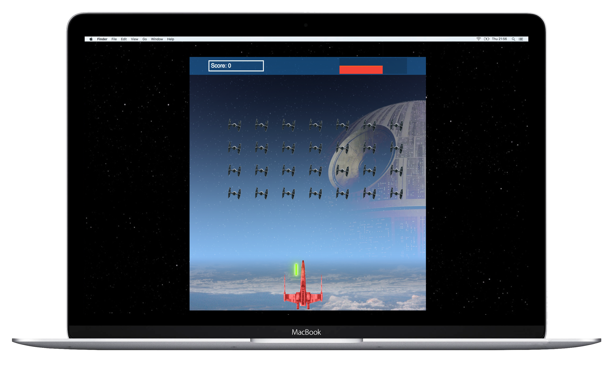
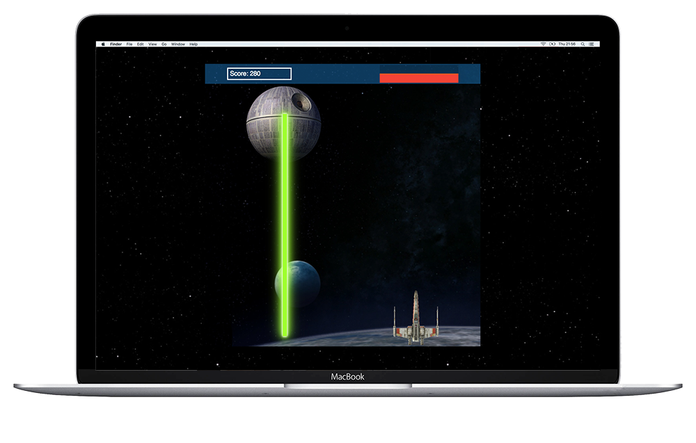
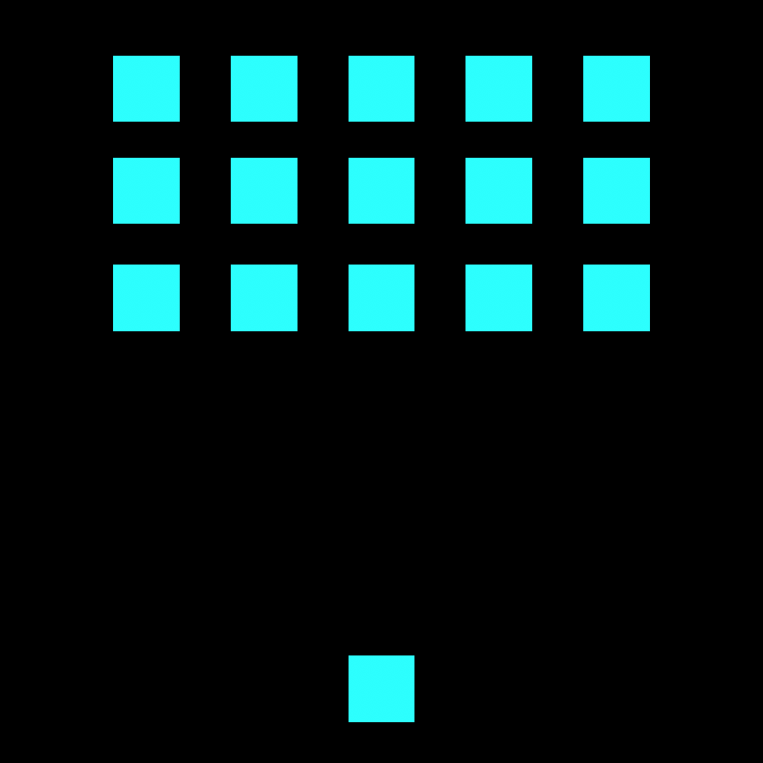

# Project 1: Space Invaders (Star Wars Theme)



Play the game (desktop only): https://noopsyjoshi.github.io/wdi-project-one/

### Overview
I had a week to build a browser game using Javascript, HTML5 and CSS3. I developed the classic arcade game 'Space Invaders', with a Star Wars theme.

### Gameplay

The aim of the game is to defeat the incoming enemies and the boss (the Death Star) without depleting the players life to zero. The game uses the left and right arrows to move the character along the bottom of the screen and the spacebar to shoot at the gradually descending enemy on level 1, and the boss enemy on level 2. The player is given a full health bar at the beginning of the game, which reduces when the player is hit by the enemy shot.


This is a single player game.

### Technologies Used
- HTML5
- HTML5 Audio
- CSS3
- Javascript (ES6)
- Git
- GitHub

### Approach Taken
The original game idea was to develop a grid of enemies which periodically moves across the screen and move closer to the player when the boundaries of the game box are hit. I created a simple wireframe using PhotoShop containing a grid of enemies and the player.



Firstly, I used keyboard events to move the player and fire bullets. I then used set intervals to move the player's bullet upwards and also to periodically move enemies across the screen.

Once I had basic player and enemy movement in place, the next step was to integrate the core functionality of the game which determines victory or defeat, collision detection.

I formulated a function which determines whether or not an enemy has been hit by finding the boundaries of the bullet and the enemy and then calculating if they overlap.

I reached MVP quite early on in the project, which opened doors to add more features. I decided to allow the enemy to fire back at the player. I was able to add a boss level, the 'Death Star'. To make the game more exciting, I added a laser beam emerging from the Death Star, which would almost destroy the players health if hit.

### Wins
- As most of my game's winning logic relies heavily on collision, I had to formulate a way to detect collision between all occurrences, not only between the player's bullet and the enemy (on level 1). A huge win was to refactor the collision detection to pass multiple objects and run the calculation. This is shown in the code snippet below -

```javascript
function objectsCollide(obj1, obj2) {
  const box1 = obj1.getBoundingClientRect();
  const box2 = obj2.getBoundingClientRect();
  return (box1.right > box2.left) && (box1.left < box2.right)
  && (box1.top < box2.bottom) && (box1.bottom > box2.top);
}
```

### Challenges
- I ran into an issue where I wasn't able to remove the exact enemy that was hit with the player's bullet. If I removed the enemy from the grid, the remaining enemies would fill the space. To resolve this, I used attribute ID's to hide the enemy that was hit.
- Refactoring the collision detection to enable detection between 4 instances posed as a huge challenge. I had to check and see if there were overlapping boundaries between the player's bullet and the enemy, the enemy's bullet and the player, the boss enemy's laser beam and the player and finally, the player's bullet and the boss enemy.

### Bonus Features
After achieving the core objectives, I decided to introduce a few more features that would improve user experience and interactivity.
- Player and enemy health bar
- Scoring system
- Home Screen
- Graphics and sound effects. I wanted to make the game feel relatable to Star Wars and tell the story of the final battle in Star Wars episode 4 (A New Hope)

### Future Features
- Add gameplay instructions to home screen
- Add Star Wars 'crawling' text as a game intro using CSS Animations
- Add multiple levels where the speed of the enemies moving across the screen increases for each level, making the game more difficult for the player - this will make the boss level feel more rewarding
- Take a look at adding responsiveness make the game playable on a tablet
